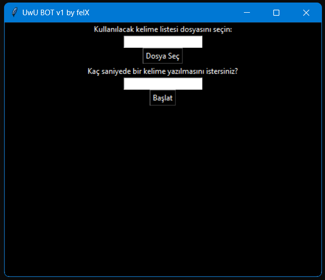

<h1>UwU BOT</h1>

UwU Spam Machine :D This project for spamming messages.

<b>!!!</b>

This project is for educational purposes only, we are not responsible for malicious use.

<b>!!!</b>

<h2>Languages ​​of the Software Used</h2>

- Python

<h2>SETUP</h2>

Download Python

<button>https://www.python.org/</button>

Open CMD or Bash and paste this commands in project file : 

<h3>pip install keyboard</h3>

<h3>pip install tk</h3>

<h2>RUN APP AND ENJOY !!!</h2>

py main.py

<h2>SCREEN SHOT</h2>

